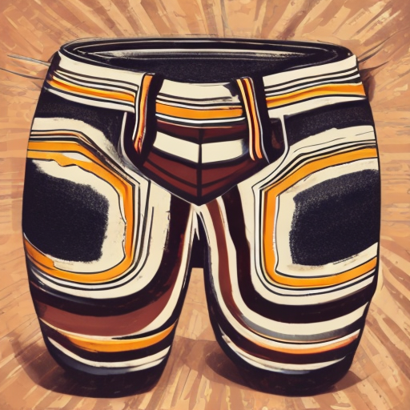
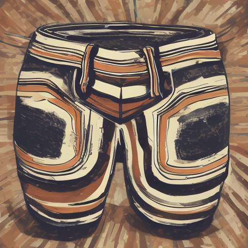
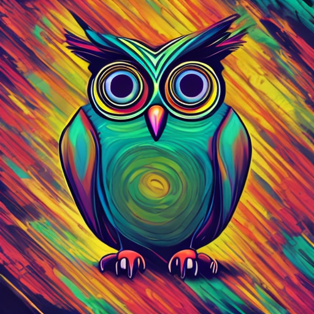

| 第四届计图人工智能挑战赛

# 赛道二：风格迁移图片生成，DreamBooth + LoRA + Styleid

实例生成结果：





​                  参考风格图片                              DreamBooth + LoRA                                    Styleid

## 简介

本项目包含了第四届计图人工智能挑战赛 - 风格迁移图片生成（B榜）的代码实现。本项目采用DreamBooth+LoRA+Styleid的方法对参考的28种风格图片进行学习，在每种风格仅有3张参考图的条件下，设计了一套先生成，再调整的框架，其中调整模块是无训练的。结果表明，对风格中特征的学习和主体的保留中取得了很好的效果。

## 链接


## 安装 

本项目可在 1 张 4090 上运行，基础图片的训练时间约为 4 小时，推理出基础图片的时间约为 1.5 小时，对基础图片的风格调整，生成最终结果的时间大约为 4 小时，共计大约 9.5 小时。

#### 运行环境
- ubuntu 20.04 LTS
- python >= 3.9.0
- jittor >= 1.3.9.5

#### 安装依赖

#### 0.执行以下命令安装相应的环境

```
conda env create -f environment.yml
```

#### 1. Clone JDiffusion & Prepare Env

```
git clone https://github.com/JittorRepos/JDiffusion.git
```

#### 2. Install Requirements

安装JTorch版本的相关深度学习库：

```
conda activate jit
pip install git+https://github.com/JittorRepos/jittor
pip install git+https://github.com/JittorRepos/jtorch
pip install git+https://github.com/JittorRepos/diffusers_jittor
pip install git+https://github.com/JittorRepos/transformers_jittor
```
#### 3. Install JDiffusion

```
cd JDiffusion
pip install -e .
```
#### 预训练模型

使用的预训练模型为[stabilityai/stable-diffusion-2-1 at main (huggingface.co)](https://huggingface.co/stabilityai/stable-diffusion-2-1/tree/main)

## 数据预处理
参考风格数据（Style_B）见https://cloud.tsinghua.edu.cn/f/4caf92b9ac6444659597/?dl=1

将B放到./内


## 复现结果
一键生成结果可以运行以下命令：
```
python test.py
```

## 致谢

此项目基于论文 *DreamBooth: Fine Tuning Text-to-Image Diffusion Models for Subject-Driven Generation* 实现.

此项目基于论文 *Style Injection in Diffusion: A Training-free Approach for Adapting Large-scale Diffusion Models for Style Transfer*实现。

## 联系方式

QQ:603239075
